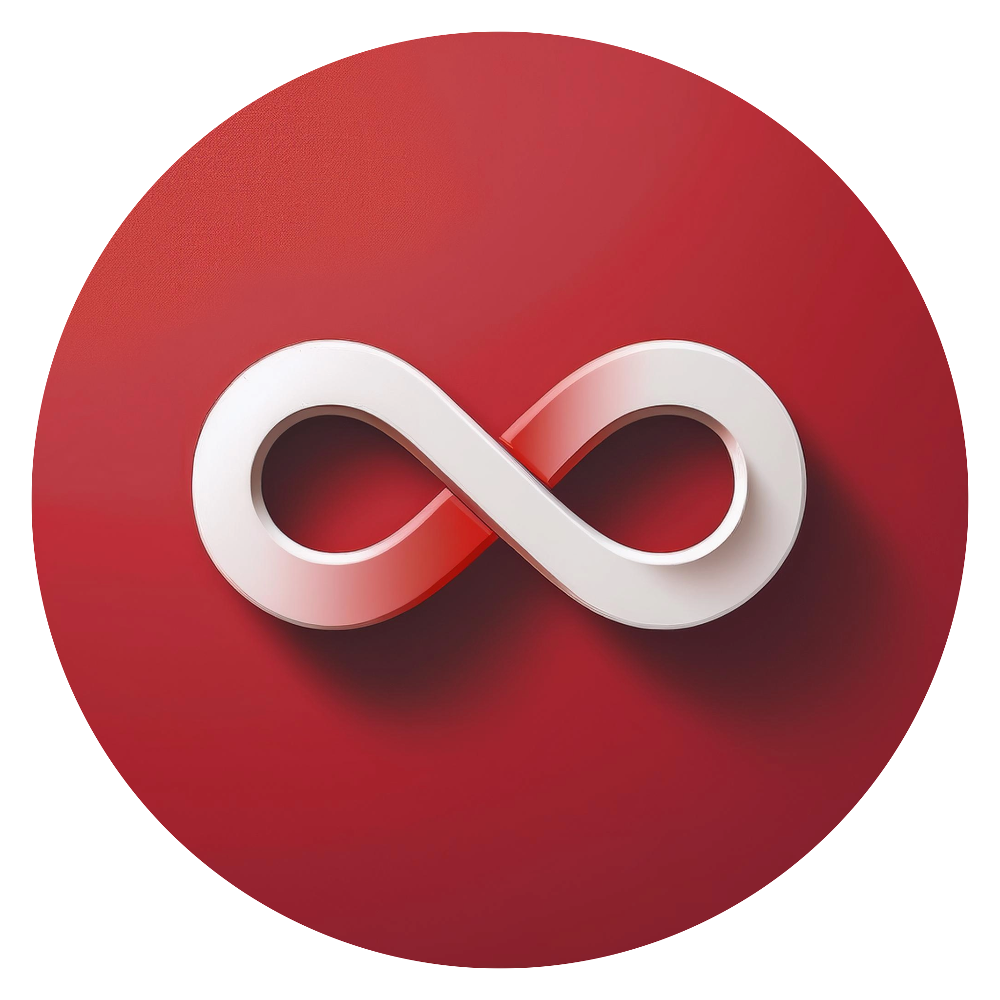

<div align="center">
  
  <h1>Converto</h1>
  <p><strong>Infinite Free Multimedia Converter & Ultra-Fast Video Compressor — Convert & Compress images, audio, and video with no limits.</strong></p>

  <p>
    <a href="https://converto-bay.vercel.app/">🌐 Live Demo</a> ·
    <a href="https://github.com/ahmadsidikrofi/converto/issues">🐛 Report Bug</a> ·
    <a href="https://github.com/ahmadsidikrofi/converto/issues">✨ Request Feature</a>
  </p>

  
  
  
  
  
</div>

---

## 📖 About Converto

**Converto** is a free, unlimited, privacy-first multimedia file converter and compressor. Built by **Ahmad Sidik Rofiudin**, Converto allows anyone to convert and compress image, audio, and video files directly inside their browser — 100% client-side, zero cost, no file size limits, and no server uploads required.

---

## ✨ Key Features & Engine Enhancements

### ⚡ High-Performance Multimedia Converter (Improved!)
- **Lossless Stream Remuxing (`-c copy`):** Container conversions between modern video formats (`MP4`, `MKV`, `MOV`, `M4V`) run in **sub-100 milliseconds** with **0% CPU re-encoding overhead** and **100% original quality preserved**.
- **Native Browser Canvas Image Engine:** Bypasses WASM memory constraints for standard image conversions (`PNG`, `JPG`, `JPEG`, `WEBP`) using hardware-accelerated HTML5 Canvas 2D.
- **Smart Transparency Handling:** Automatically paints a crisp white background (`#FFFFFF`) under transparent PNGs when exporting to JPEG to prevent black artifacts or memory errors.
- **Incremental Real-Time Downloads:** As each file in a multi-upload queue finishes processing, its status updates instantly to **Done** with an active Download button, allowing immediate file access without waiting for the full queue.
- **Self-Healing WebAssembly VM:** Includes an automated VM resurrection mechanism that instantly re-initializes `@ffmpeg/ffmpeg` if an unsupported stream or memory exception occurs, preserving batch queue continuity.
- **Single-Thread Buffer Safety (`-threads 1`):** Strict WebAssembly linear memory heap limits prevent out-of-bounds crashes during video transcoding.

### 🚀 Ultra-Fast Media & Video Compressor (New!)
- **WhatsApp & Email Target Preset (< 25MB Guarantee):** Automatically calculates video bitrates based on duration to guarantee the compressed video output stays strictly below **24.5 MB** for instant messaging and email attachments.
- **Flexible Compression Presets:**
  - 💬 **WhatsApp / Email (< 25MB):** Auto-calculated bitrate & resolution adjustment.
  - ⚖️ **Balanced (-50% Size):** High visual quality with ~50% file size reduction.
  - 🚀 **Extreme (-75% Size):** Maximum size savings for quick sharing & archiving.
- **Custom Resolution Scaling:** Choose between `Auto / Original`, `1080p (FHD)`, `720p (HD)`, and `480p (SD)`.
- **Live Size & Savings Preview:** Displays estimated file size and percentage saved before hitting compress.
- **Unified Media Pipeline:** Seamlessly handles both images (via `browser-image-compression`) and video streams (via `@ffmpeg/ffmpeg`).

### 🖼️ Image Transformation
- Convert between image formats (`JPEG`, `PNG`, `WEBP`, `BMP`, `ICO`, `TIFF`, `GIF`, `TGA`).
- Auto-scaling for ICO icon output (max 256x256 boundary protection).

### 🎵 Audio Processing & Extraction
- Convert audio files across multiple formats (`MP3`, `WAV`, `AAC`, `OGG`, `FLAC`, `WMA`, `M4A`).
- Fast audio extraction from video files (`-vn`).

### ✍️ e-Sign PDF & Verification
- **Custom Digital Signature:** Draw signatures manually with full-precision ink brush tracking.
- **Secure Verification (QR Code):** Generate a unique QR Code verification link embedded onto the signed PDF.
- **Cryptographic Integrity Check (SHA-256):** Calculates file hashes client-side via Web Crypto API to detect any post-signing alterations.
- **Secure Firestore Registry:** Verifies document integrity without storing actual PDF files on servers.

### 🔒 Privacy & Security
- **100% Client-Side Processing:** Files are processed locally in WebAssembly memory or browser Canvas — your files are **never** uploaded to an external server.
- **Absolute PDF Privacy:** Only document metadata (signer name, timestamp, signature image) and SHA-256 cryptographic hashes are stored in Firestore for verification.

---

## 🛠️ Tech Stack

| Category | Technology |
|---|---|
| **Framework** | [Next.js 14](https://nextjs.org/) (App Router) |
| **UI & Styling** | [React 18](https://react.dev/), [Tailwind CSS](https://tailwindcss.com/), [shadcn/ui](https://ui.shadcn.com/) (Radix UI) |
| **Video & Audio Processing** | [@ffmpeg/ffmpeg](https://ffmpegwasm.netlify.app/) (WebAssembly v0.12) |
| **Native Image Engine** | HTML5 Canvas 2D API + [browser-image-compression](https://github.com/Donaldcwl/browser-image-compression) |
| **Database & Hash Registry** | [Firebase Firestore](https://firebase.google.com/) |
| **PDF Processing** | [pdf-lib](https://pdf-lib.js.org/) + [react-pdf](https://github.com/wojtekmaj/react-pdf) |
| **File Archiving** | [JSZip](https://stuk.github.io/jszip/) |
| **Icons & Micro-Animations** | [Phosphor Icons](https://phosphoricons.com/), [Radix Icons](https://www.radix-ui.com/icons), [Framer Motion](https://www.framer.com/motion/) |
| **Package Manager / Runtime** | [Bun](https://bun.sh/) / Node.js |
| **Deployment** | [Vercel](https://vercel.com/) |

---

## 🚀 Getting Started

### Prerequisites

- [Bun](https://bun.sh/) (Recommended) or [Node.js](https://nodejs.org/) (v18+)

### Installation

1. **Clone this repository**

```bash
git clone https://github.com/ahmadsidikrofi/converto.git
cd converto
```

2. **Install dependencies**

```bash
bun install
# or
npm install
```

3. **Run the development server**

```bash
bun dev
# or
npm run dev
```

4. **Open in your browser**

```
http://localhost:3000
```

---

## 📁 Project Structure

```
converto/
├── public/                 # Static assets & brand logos
├── src/
│   ├── app/                # Next.js App Router pages
│   │   ├── compress/       # Ultra-Fast Media & Video Compressor
│   │   ├── convert/        # Multi-file Converter
│   │   ├── sign-your-pdf/  # e-Sign PDF Studio
│   │   └── verify/         # SHA-256 PDF Verification
│   ├── components/         # Core UI components & Dropzones
│   └── utils/              # FFmpeg WASM loader & Native Canvas engines
├── utils/                  # convertFile & load-ffmpeg helpers
├── tailwind.config.js
└── package.json
```

---

## 📦 Build for Production

```bash
bun run build
bun start
```

---

## 📄 License

Distributed under the MIT License. See `LICENSE` for more information.

---

## 👨‍💻 Author

**Ahmad Sidik Rofiudin**

- GitHub: [@ahmadsidikrofi](https://github.com/ahmadsidikrofi)
- Live Application: [converto-bay.vercel.app](https://converto-bay.vercel.app/)

---

<div align="center">
  <p>Made with ❤️ by Ahmad Sidik Rofiudin</p>
</div>
